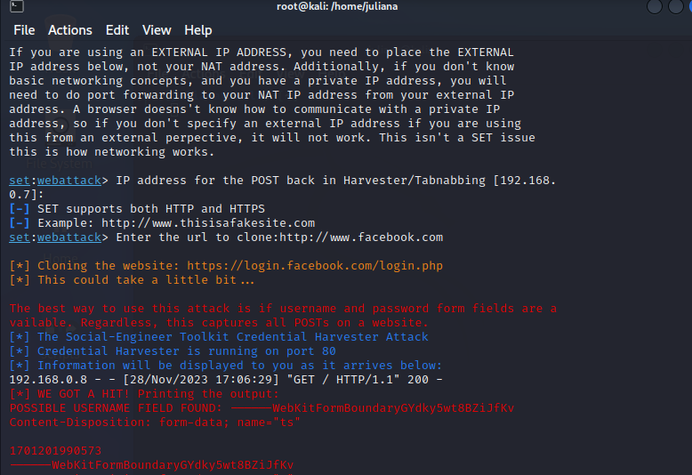

# Phishing para captura de senhas do Facebook

## Ferramentas

- KaliLinux
- Kit de ferramentas

## Configurando o Phishing no Kali Linux

- Acesso raiz: `sudo su`
- Iniciando o setoolkit: `setoolkit`
- Tipo de ataque: `Social-Engineering Attacks`
- Vetor de ataque: `Web Site Attack Vectors`
- Método de ataque: `Credential Harvester Attack Method` 
- Método de ataque: `Site Cloner`
- Obtendo o endereço da máquina: `ifconfig`
- URL para clonar: `http://www.facebook.com`

## Resultado 

